**完整代码 +  QQ: 316595344     或   WX: lz316595344  咨询**

**接毕业设计和论文**

**如果图片加载不出来可以去博客看 https://blog.csdn.net/qq_56450993/article/details/136279873**

**毕业设计所有选题地址**

[github]👉https://github.com/XinChennn/allProjects

[忻辰的个人博客]👉https://www.ixinjiu.cn/articles/156

# 一、系统介绍
- cinema项目是一套电影院会员管理系统，使用前后端分离架构开发
- 包含管理员、会员管理、会员卡管理、电影票、消费记录、数据统计等模块

# 二、所用技术
后端技术栈：
- Springboot + Mybatis + Swagger2 + Maven +mysql

前端技术栈：
- Vue.js
- Element UI

# 三、环境介绍
基础环境 :IDEA/eclipse, JDK 1.8, Mysql5.7及以上,Node.js,Maven

所有项目以及源代码本人均调试运行无问题 可支持远程调试运行

# 四、项目截图
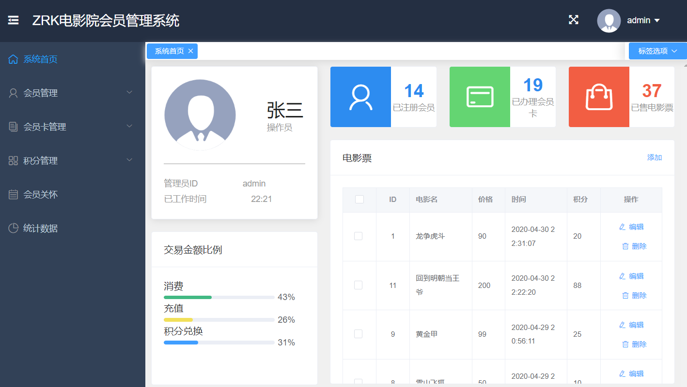

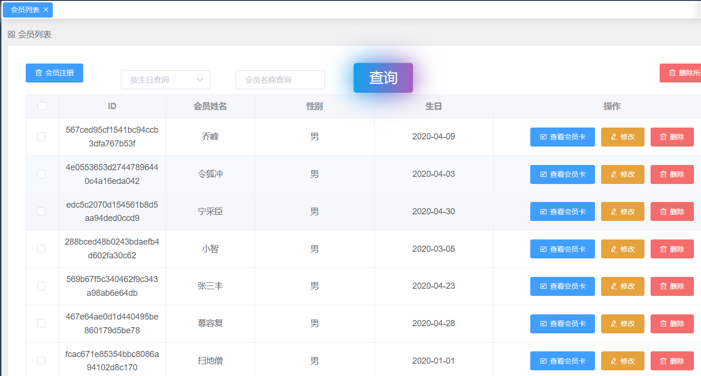

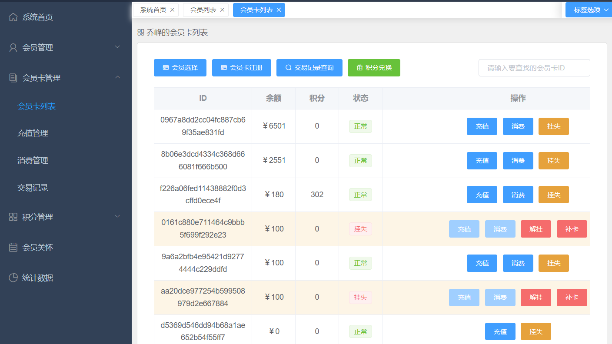

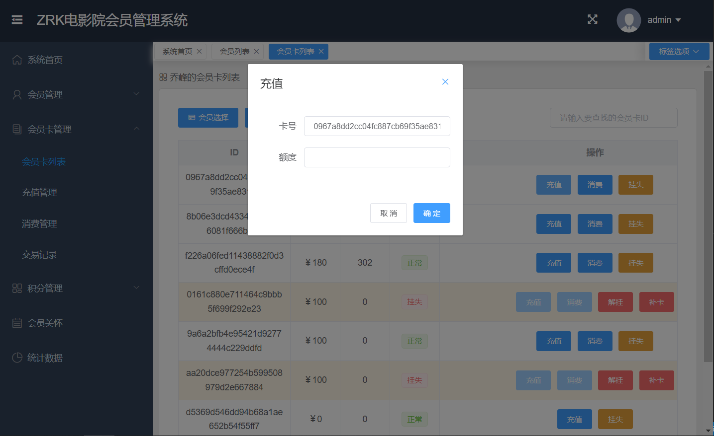

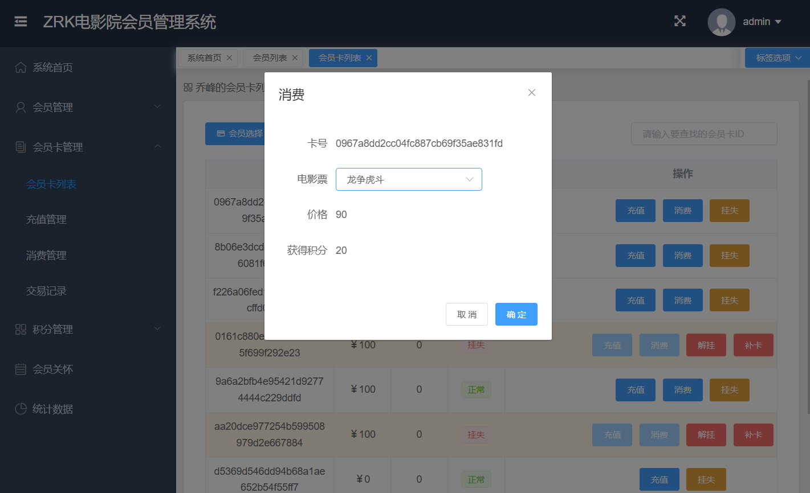

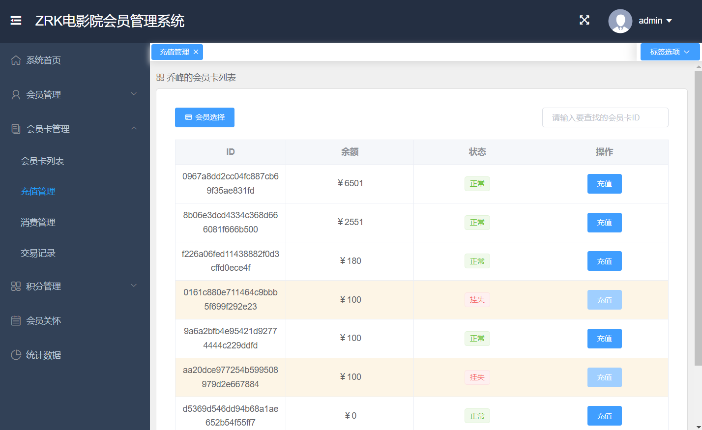

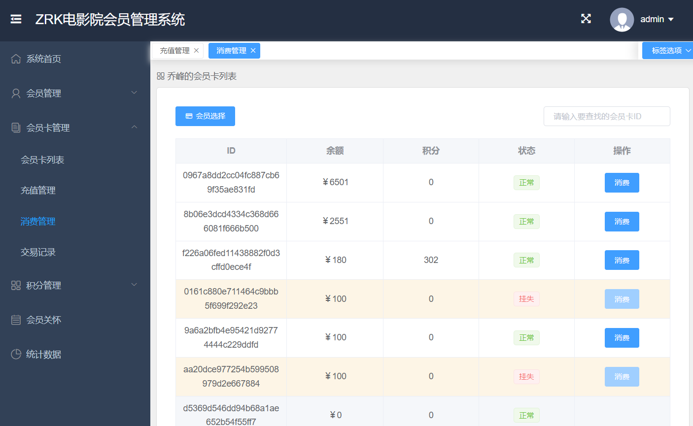

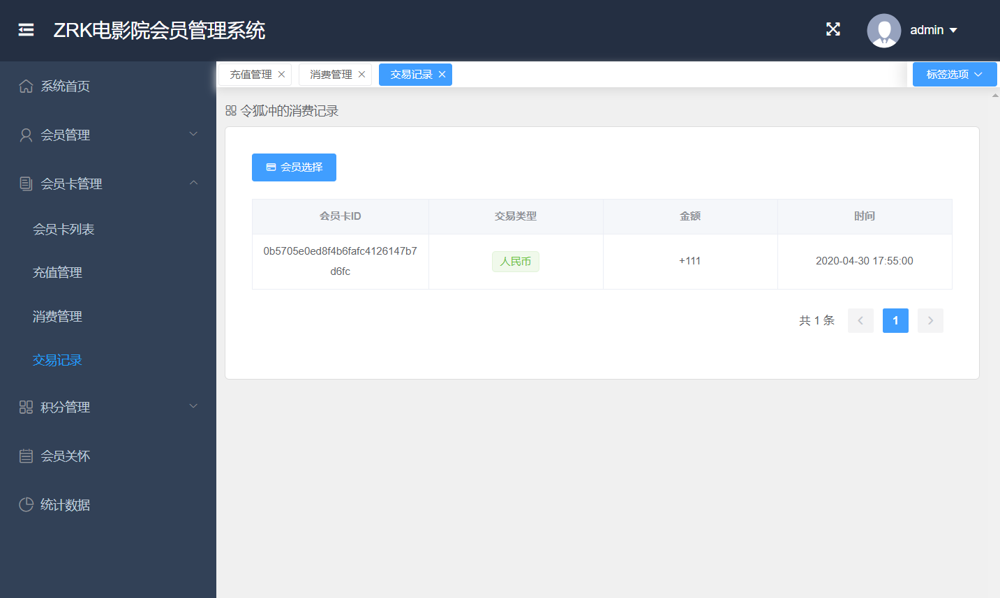

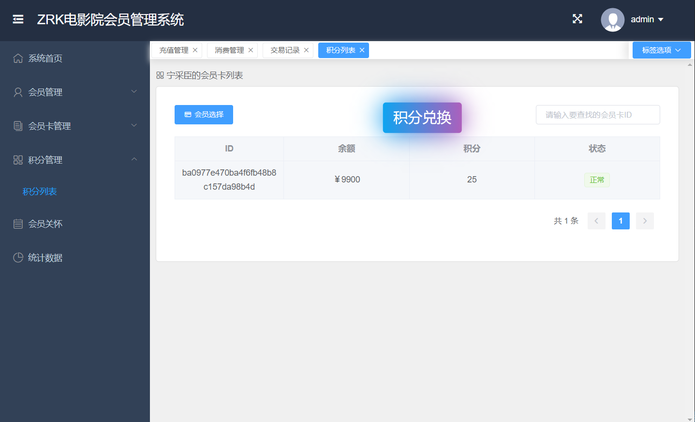

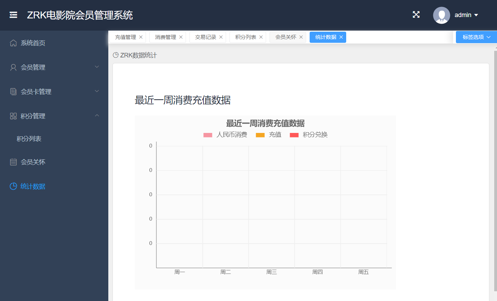

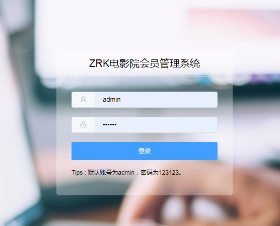

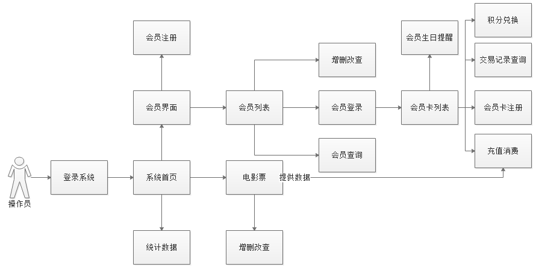

# 五、浏览地址
http://localhost:8081/cinema

用户名：admin 密码：123123

# 六、安装教程（购买项目附赠免费部署）
- 方法一: cinema项目中已经整合了vue打包的静态资源，直接启动项目，并在浏览器上输入http://localhost:8081/cinema 即可运行。
- 方法二: cinema-web项目是cinema项目的vue单页面前端项目，可以在文件夹目录下命令行输入： npm run install
npm run dev 后，修改utils/request.js下baseURL=”/api”,开启node反向代理服务器,解决跨域问题,然后启动cinema后端项目，在浏览器上输入 http://localhost:8080 即可以前后端分离方式运行(也可以npm run build后将dist文件夹放到nginx下运行)

**完整代码 +  QQ: 316595344     或   WX: lz316595344  咨询**

**接毕业设计和论文**
